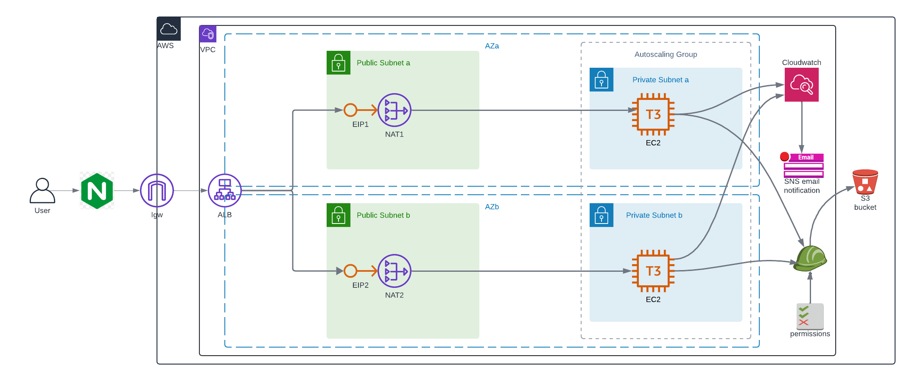
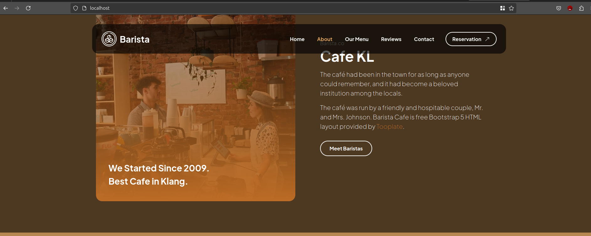

# High Availabiliy Infrastructure Deployment Using Terraform and AWS


## Table of Contents
- [Project Overview](#project-overview)
- [Prerequisites](#prerequisites)
- [Infrastructure Components](#infrastructure-components)
- [Usage](#usage)
- [Terraform Module Structure](#terraform-module-structure)
- [Inputs](#inputs)
- [Outputs](#outputs)
- [AWS Services Used](#aws-services-used)
- [NGINX Configurations](#nginx-configurations)

## Project Overview
This terraform configurations set up a high availability insfrastructure in AWS.
An nginx server as a reverse proxy between the user and the AWS infrastructure.
Services provisioned in aws are:
 - VPC with private and public subnets in two AZs.
 - Application Load Balancer (ALB) to distribute incoming traffics to target groups in different AZs.
 - Launch Templates to deploy instances with autoscaling-policies
 - Use S3 bucket to store static web content
 - Monitoring and alarm triggering scaling policies with CloudWatch.


## Prerequisites
- Terraform (v1.9+) installed on your local machine or virtual machine
- AWS CLI installed and configured
- SSH key pair to authenticate and test instance provisioning e.g (private-server.pem)
- S3 bucket to store your static web page
- nginx installed on your local machine or virtual machine


## Infrastructure Components
1. **VPC and Networking**  
   - Public and Private Subnets  
   - NAT Gateways and Internet Gateway

2. **Compute Resources**  
   - EC2 Instances with launch templates  
   - Auto-scaling group

3. **Load Balancer**  
   - Application Load Balancer (ALB)  
   - Target Groups and Listeners

4. **Monitoring and Alerts**  
   - CloudWatch alarms  
   - SNS notifications

## Usage
1. Clone the repository.
```
git clone https://github.com/izanna-ju/ha-infra-setup.git
```
2. Initialize Terraform.
```
terraform init -backend-config=<your-backend-conf-file>
```
3. Configure AWS credentials.

There are several ways to configure your environment to use your preferred aws credentials. I prefer to use environment variables to pass the secrets during runtime without hardcoding the secrets. 

```
export AWS_ACCESS_KEY_ID=<your-access-key>
export AWS_SECRET_ACCESS_KEY=<your-secret-access-key>
export AWS_PROFILE=<your-profile>
export AWS_REGION=<your-preferred-aws-region>

```
4. Create a Terraform workspace.

This step is optional

```
# choose a terraform workspace to deploy your infrastructure 
terraform workspace new dev
```
5. Verify terraform configurations.
```
terraform fmt -check  # to properly format your configuration to improve readability 
``` 
```
terraform validate  # ensure your configuration uses the corrent syntax and block structure
```
6. Run terraform plan to ensure the proper Infrastructure component and associated configurations are setup.
```
terraform plan -var="endpoint=<your-email-address>"
```
Email address is required as endpoint for the sns topic to send notifications to. 
Ensure you confirm the subscription to receive further notification updates.

7. Apply the Terraform configuration.

```
terraform apply -var="endpoint=<your-email-address>" -auto-approve
```
6. Destroy the infrastructure.
```
terraform destroy -var="endpoint=<your-email-address>" -auto-approve
```

## Terraform Module Structure

This project module is divided into:

- Root module: Located in ./infra_instance, main.tf defines core resources, variables, and outputs.
- Child module: Located in ../module_infra and used to create reusable module components like security groups, launch templates, and load balancers.

## Inputs
| Variable          | Type   | Description         | Sensitive | Default |
|-------------------|--------|---------------------|-----------|---------|
| `bucket_name`     | string | Name of the S3 bucket | No       | -     |
| `environment_name`| string | Terraform workspace  | No       | default    |
| `endpoint`        | string | email-address    | Yes      | -    |
| `region`          | string | AWS region          | No       | us-east-1 |

## Outputs
| Output                  | Description                   |
|-------------------------|-------------------------------|
| `load_balancer_dns_name`| Load balancer public DNS URL  |

## AWS Services Used
- EC2: Virtual servers to host the web application.
- S3: Store static content for the web server.
- VPC: Private network for secure resource allocation.
- IAM: Role-based access for the EC2 instances.
- NAT Gateway & Internet Gateway: Route internet traffic.
- CloudWatch: Monitor CPU usage and trigger scaling events.
- SNS: Send email notifications on scaling events.
- Autoscaling: Automatically adjust capacity based on traffic.
  - Auto-Scaling Policies: 

    -   Scaling Policy for ASG:
        If CPU utilization > 80% for 2 evaluation periods, increase instances provisioning by 4.

    - CloudWatch Alarm Configuration:
        Monitors CPU usage and triggers the scaling policy.

    -  SNS Notification:
        Sends email alerts to the subscribers in the SNS topic.  * 

## NGINX COnfigurations

After set up your aws infrastructure and have retrieved the dns name of your load balancer, you can configure an nginx server to further protect your infra and act as a reverse proxy to your aws infra. 

### Setup
```
sudo apt update && sudo apt install nginx -y
```
### Configuration steps
1. Open your terminal of choice and cd to /etc/nginx/sites-available directory.
 Create a lb-reverse-proxy file in this location.
```
sudo nvim /etc/nginx/sites-available/lb-reverse-proxy
```
2. Add the following configuration in lb-reverse-proxy file
```
server {
    listen 80;

    server_name localhost;  # domain name or ip of your device or local host

    location / {
        proxy_pass <http://your-alb-dns-name>;
        proxy_set_header Host $host;
        proxy_set_header X-Real-IP $remote_addr;
        proxy_set_header X-Forwarded-For $proxy_add_x_forwarded_for;
        proxy_set_header X-Forwarded-Proto $scheme;
    }
}
```
3. Enable the configuration by creating a symbolic in the sites-enabled directory 

```
sudo ln -s /etc/nginx/sites-available/lb-reverse-proxy /etc/nginx/sites-enabled
```
4. Test your configuration for syntax error
```
sudo nginx -t
```
5. Reload your nginx service
```
sudo nginx -s reload
```
6. Confirm the configuration work as expected by entering localhost on your browser of choice.


